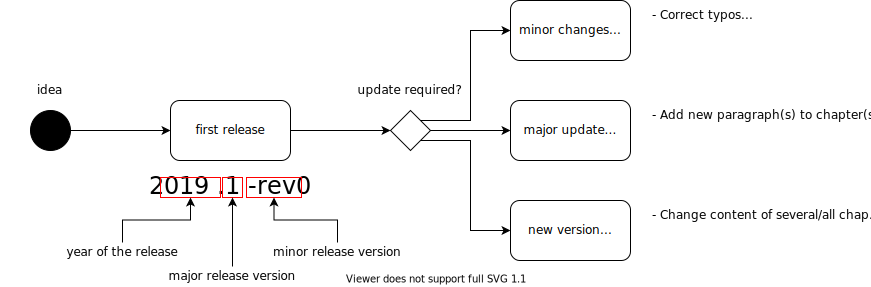

# iSAQB Github Readme

This Github organisation holds repositories for the [iSAQB](https://isaqb.org), especially curricula, glossary and references.

In case of questions or suggestions, please contact:

* iSAQB technical support: support -at- isaqb -dot- org
* For Foundation-Level curricula and content: gs -at- gernotstarke -dot- de
* For the Advanced Level Curriculum Template: bwolf -at- isaqb -dot- org

## Release Process for Curricula

### Proposal for a (slightly) more sophisticated versioning scheme

#### Why make this "more complicated"?

* A uniform versioning scheme  (or style) for **all** artifacts (including exam sheets) would be highly beneficial.
* We really do not want to define, document, communicate and use a *different* versioning scheme for *some* documents.
* Versioning for the exam sheets has the most far reaching requirements. When we define a scheme that satisfies these requirements *and* is not overly complicated, we are settled for all artifacts.

#### What are the special requirements for exam sheets?

* Exam sheets are maintained and distributed in several languages.
* Only DE and EN versions are maintained directly by the FL Working Group. All others are based on these and updated by external entities.
* We need to be *very* precise about which version we refer to.
* We need to be *very* precise about which versions have identical contents. (= "They contain exactly the same questions in another language.")
* We have (regularly) encountered edits that contain only minor changes *within a single language version* that do **not** substantially alter the meaning of the affected questions. E.g. minor wording changes, grammar fixes, etc.
* Propagating these small changes across all languages by raising the version number of all language versions
  * is impractical as it would imply additional workload for many stakeholders (all certifiers)
  * makes no sense as there actually is no change in the other language versions
* Exam sheets exist in different "variants" or "questions sets", but this will have no implications for the versioning of other artifacts.

#### What is proposed?

The version scheme should be **{year=major}.{minor}.{lang}.{patch}**, e.g. 2020.1.de.0

* Changes that only affect one language version and do not substantially alter the question itself increase *patch*
* Changes that substantially alter a question need to propagate across all languages:
  * if this is *not* the first release in the current year: increase *minor*, reset *patch* to 0.
  * if this is the first release in the current year: set *year* to current year, reset *minor* (to 0 or 1, see side quest below), reset *patch* to 0
  
#### Considerations/Discussion

* This is IMHO applicable to all other artifacts without being overly complicated and satisfies requirements for exam sheets.
* As year=major could be confusing, but essentially boils down to a naming problem, we should discuss which solution fits best:
  * {year=major}.{minor}.{lang}.{patch}
  * {year}.{major}.{lang}.{patch}
  * {year}.{major}.{lang}.{minor}
  * or even {year}.{major}.{minor}.{lang}.{patch} (which might be overkill)
* Exam sheets will be versioned with {variant}.{year=major}.{minor}.{lang}.{patch}, e.g. Fragebogen A.2020.1.de.0  (or whatever we choose for versioning after *variant*)
* Maybe not all versions might be distributed for release. We should consider the requirement to utilize consistent versioning for our internal review process as well. Would we be fine with e.g. Version 2020.3.en.2 being the first officially released version for a 2020 english curriculum? If not, we have an orthogonal requirement to internally label pre-release versions which might complicate things pretty much.

#### Sidequest: Start with 0 or 1 after increasing *year*

* This is about whether the first version for e.g. 2020 is something like **2020.1.whatever** or **2020.0.whatever**.
* Personally I have no strong preference for one or the other
  * [Semver](https://semver.org/) suggest that 0 would be the right choice when we consider *year* to indicate a major version.
  * but 1 looks prettier and more mature

