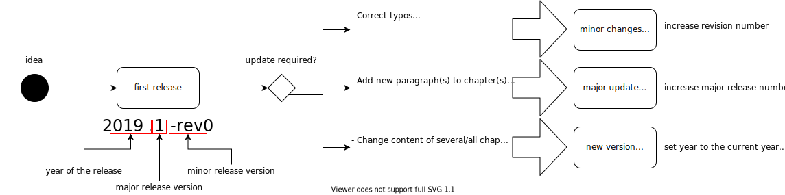

# iSAQB Github Readme

This Github organisation holds repositories for the [iSAQB](https://isaqb.org), especially curricula, glossary and references.

In case of questions or suggestions, please contact:

* iSAQB technical support: support -at- isaqb -dot- org
* For Foundation-Level curricula and content: gs -at- gernotstarke -dot- de
* For the Advanced Level Curriculum Template: bwolf -at- isaqb -dot- org

## Release Process for Curricula

