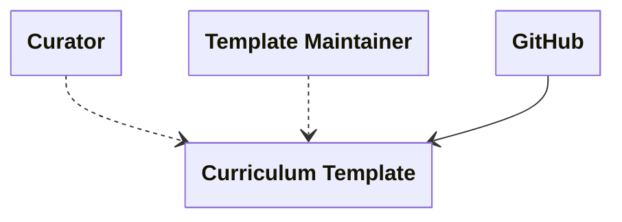
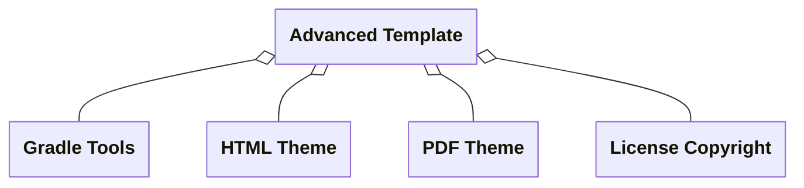
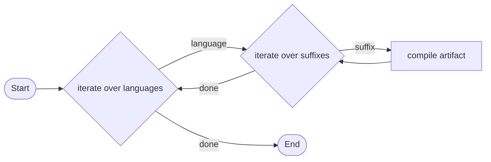
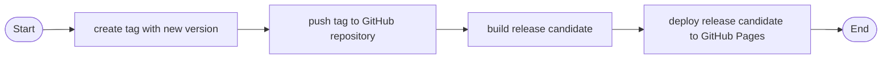

# Introduction and Goals
The iSAQB curriculum template is intended to be used as a basis for the development of curricula for the iSAQB certification program.

## Requirements Overview
Currcula shall support curators to develop curricula for the iSAQB certification program. They provide a basis for repeatable and robut rendering of curriculum documents in a standardized iSAQB format in multiple languages.

## Quality Goals
The following top three quality goals are guiding the architecture of the template:
1. **Reusability:** The template shall be usable for all curricula in the iSAQB certification program.
2. **Reliability:** The template shall reliably render curricula without indeterministic errors.
3. **Usability:** The template shall be easy to use for curators regardless of their technical capabilities.

## Stakeholders
| Stakeholder       | Expectation                                                   |
|-------------------|-----------------------------------------------------------------------------|
| Curator           | The template shall be usable for all curricula in the iSAQB certification program.  It shall reliable produce corretly formatted documents.  Also the temlate shall be easy to duplace, edit and build/compile. |
| Curriculum Reader | Curricula created with this template shall be well structured and easy to read/navigate. |
| Template Maintainer | The template and forked curricula shall be easy and efficient to maintain. |

# Architecture Constraints
## Technical Platform
The curriculum template has to work within the infrastructure available to iSAQB, namely the GitHub platform. GitHub fulfills multiple different roles for the templates and its forks aka the actual curricula:
- version control system for sourcecode
- build tool
- release management
- artifact repository
- task and issue management
## Open Source
The curriculum and its forks are open source system available on a public platform, yet it is licensed specifically for iSAQB. Technical components have to be compliant to this license and open source model. 

# Context and Scope
This diagram shows all users and systems involved in the curriculum template.

### Elements
| Elements            | Type           | Description                                                                      |
|---------------------|----------------|----------------------------------------------------------------------------------|
| Curator             | Role           | A curator is a person who creates curricula for the iSAQB certification program. |
| Template Maintainer | Role           | A template maintainer is a person who maintains the curriculum template.         |
| GitHub              | Infrastructure | The GitHub platform is the infrastructure available to iSAQB.                    |

### Relations
| Relation                              | Type   | Description                                                             |
|---------------------------------------|--------|-------------------------------------------------------------------------|
| Curator → Curriculum Template          | access | A curator creates curricula for the iSAQB certification program.        |
| Template Maintainer → Curriculum Template | access | A template maintainer updates dependencies and solves technical issues. |
| GitHub → Curriculum Template           | serves | The curriculum template is hosted, versioned and built on GitHub.       |

# Solution Strategy
## AsciiDoc based template
The curriculum template is based on AsciiDoc, which allows for a simple and easy to read and edit format. Content and styling of documents are strictly decoupled from each other. Compiling documents is repeatable and can be automated.

## GitHub repositories as modules
To separate different template concerns from each other, such as license, PDF theme, HTML theme or build tools, all of these are separated into their own repositories. Using GitHub modules they can be integrated into the main curriculum template repository. As the reference to GitHub modules is versioned, they can be updated independently.

# Building Block View
## Level 1

### Building Blocks
| Building Block     | Type       | Description                                                     |
|--------------------|------------|-----------------------------------------------------------------|
| Advanced Template  | Repository | Main repository of curriculum template.                         |
| Gradle Tools       | Repository | GitHub module containing build related logic and configuration. |
| HTML Theme         | Repository | GitHub module containing the theme for HTML format output.      |
| PDF Theme          | Repository | GitHub module containing the theme for PDF format output.       |
| License Copyright  | Repository | GitHub module containing license and copyright legal texts.     |

### Relations
| Relation                                                                                    | Type | Description                                                                   |
|---------------------------------------------------------------------------------------------|------|-------------------------------------------------------------------------------|
| Advanced Template →  Gradle Tools, HTML Theme, PDF Theme, License Copyright | aggregate | Advanced Templates imports well defined aspects from idfferent GitHub modules. |

# Deployment View
The following chapters describe the build process that creates artifacts and the release process for new curriculum versions.

## Build Process
The build process is based on Gradle in combination with the open source plugin [AsciiDoctor](https://docs.asciidoctor.org/asciidoctorj/latest/).
Apart from certain properties, the build process is the same for all output formats, which currently are *PDF* and *HTML*.

### Build Steps
| Build Step             | Type      | Description                                                                                                      |
|------------------------|-----------|------------------------------------------------------------------------------------------------------------------|
| iterate over languages | Iteration | Iterate over languages configured in `/build.gradle` file. By default `DE` and `EN`.                             |
| iterate over suffixes  | Iteration | Iterate over suffix tags configured in `/build.gradle` file. By default ` `.                                     |
| compile artifact | Compilation | Compile existing `*.adoc` files in `/doc` according to current language and suffix. Add result artifact to `/build`. |

## Release Process
The release process is based on GitHub actions. 

### Release Steps
| Release Step             | Type          | Description                                                                                                                                                                                                                                                                                                                                                |
|------------------------|---------------|------------------------------------------------------------------------------------------------------------------------------------------------------------------------------------------------------------------------------------------------------------------------------------------------------------------------------------------------------------|
| create tag with new version | Manual Action | Curator creates a new tag with the version number following the schema [year].[major version]-[revision]. Year corresponds to the release date of current major version (e.g. current year, if a new major version is released), Revision corresponds to the amount of updates of current major version (e.g. `rev0`, if a new major version is released). |
| push tag to GitHub repository | Manual Action | Curator pushes the tag to the GitHub repository.                                                                                                                                                                                                                                                                                                           |
| build release candidate | GitHub Action | GitHub action triggers due to the new tag and build the release candidate as described in [Build Process](#build-process).                                                                                                                                                                                                                                 |
| deploy release candidate to GitHub Pages | GitHub Action | GitHub action deploys the release candidate to branch `gh-pages` in order to update GitHub Pages. |

# Quality Requirements

## Quality Requirements Overview
1. **Reusability:** The template shall be usable for all curricula in the iSAQB certification program.
2. **Reliability:** The template shall reliably render curricula without indeterministic errors.
3. **Usability:** The template shall be easy to use for curators regardless of their technical capabilities.
4. **Adaptability:** The template shall be easy to adapt to more languages.
5. **Maintainability:** The template shall be easy to maintain, as template maintainers are not paid.

## Quality Scenarios
| # | Quality scenario                                                                                                                                    | Affected quality characteristics |
|---|-----------------------------------------------------------------------------------------------------------------------------------------------------|-------------------------------|
| 1 | A curator wants to create a new curriculum. No technical prerequisite other than the template is needed.                                            | Reusability                   |
| 2 | A curator wants to render a curriculum. If no source files have been changed, the output is the same as before.                                     | Reliability                   |
| 3 | A curator wants to work on a curriculum. No technical know how is required other than understanding AsciiDoc.                                       | Usability                     |
| 4 | A curator want to add another language to a curriculum. Given the required content exists, just the language tag has to be added to `build.gradle`. | Adaptability                  |
| 5 | A maintainer wants to update versions. Each update can be made in a single repository instead of every single curriculum.                           | Maintainability               |
| 6 | A new version of Gradle is released. A bot automatically updates the Gradle version and tries to build the curriculum template.                     | Maintainability               |

# Risks and Technical Debts

## Risks
| # | Risk          | Description                                                                                                                       | Impact | Probability | Status   |
|---|---------------|-----------------------------------------------------------------------------------------------------------------------------------|--------|-------------|----------|
| 1 | Render Plugin | The community driven plugin [Asciidoctor Gradle Plugin](https://github.com/asciidoctor/asciidoctor-gradle-plugin) is discontinued | high   | low         | accepted |
| 2 | Build Tool    | GitHub discontinues free actions to build releases.                                                                               | medium | low         | accepted |

# Glossary

For glossary please refer to the official [iSAQB Glossary of Software Architecture Terminology](https://public.isaqb.org/glossary/glossary-en.html).
